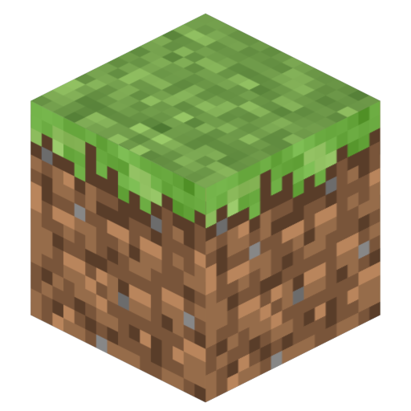
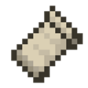

<div align="center">

<table border="0" cellpadding="16">
  <tr>
    <td align="center" width="200">
      
    </td>
    <td align="center">
      <h1 style="border: none; margin-bottom: 10px;">PocketMC Linux & macOS</h1>
      <p><b>Local-first Minecraft server management, without the terminal mess.</b></p>
      <p>Create, run, update, monitor, back up, and share Minecraft Java, Bedrock, and PocketMine servers from one native desktop app.</p>
      <a href="https://github.com/PocketMC/pocket-mc-linux-mac/actions"></a>
      <a href="https://dotnet.microsoft.com/"></a>
      <a href="https://github.com/PocketMC/pocket-mc-linux-mac/releases"></a>
      <a href="https://discord.gg/mWdMr8Mc2m"></a>
      <br><br>
    </td>
  </tr>
</table>

<br>

</div>

---

PocketMC is a native, cross-platform desktop application built using Avalonia UI and .NET 8 for Linux and macOS. It handles software downloads, isolated instances, managed Java and PHP runtimes, startup and shutdown lifecycle monitoring, real-time performance graphs, player lists, automated backups, external cloud replication (Dropbox, Google Drive, OneDrive), curseforge/modrinth addon integration, Playit.gg/Cloudflared tunnel provisioning, and a paired remote web dashboard.

Your servers run locally on your hardware. PocketMC is not a cloud hosting service, not a Minecraft launcher, and does not require Docker or system-level virtualization.

<br>

## Comparative Workflow

| Before PocketMC | With PocketMC |
|-----------------|---------------|
| Manually find, download, and configure server executables and jars. | Server binaries and matching runtime components are fully managed. |
| Fragmented terminal processes and config files scattered across disks. | Isolated instances maintained under a single structured root. |
| Complex configuration of local reverse proxies and port-forwarding. | Built-in provisioning of Playit.gg and Cloudflared tunnels. |
| Manual, irregular back-up scripts subject to failure. | Scheduled backups with zip extraction and cloud provider synchronization. |
| Vulnerability to orphaned processes and terminal lockups on close. | Automated background process tree cleanup on application exit. |
| Accessing server controls is restricted to the host machine. | Secure web dashboard pairing via QR code or clipboard URL. |

<br>

## Supported Server Software

<table border="0" align="center" cellpadding="8">
  <tr align="center">
    <td></td>
    <td></td>
    <td></td>
    <td></td>
    <td></td>
    <td></td>
    <td></td>
  </tr>
  <tr align="center" valign="top">
    <td><sub><b>Vanilla Java</b></sub></td>
    <td><sub><b>Paper</b></sub></td>
    <td><sub><b>Fabric</b></sub></td>
    <td><sub><b>Forge</b></sub></td>
    <td><sub><b>NeoForge</b></sub></td>
    <td><sub><b>Bedrock (BDS)</b></sub></td>
    <td><sub><b>PocketMine-MP</b></sub></td>
  </tr>
</table>

<br>

## Core Features

### Instance Lifecycle
- Creation and deletion of isolated server directories from the desktop interface.
- Graceful shutdown orchestration using RCON commands with standard stream input fallback.
- Active port conflict detection before launching any instance.
- Automatic process tree supervision preventing orphaned background server processes on crash or exit.
- Customizable JVM arguments and startup policies.

### Managed Runtimes
- Automatic fetching and installation of corresponding Java runtimes based on server engine version requirements.
- Standardized PHP execution bundles for PocketMine-MP instances.
- Zero manual environment variable setups or system-wide path modifications.

### Integrated Reverse Proxy Tunnels
- Quick provisioning of Playit.gg agent tunnels to instantly share servers without exposing public IPs.
- Cloudflared tunnel creation with continuous stream consumption to avoid pipe buffer deadlocks.
- Storing agent credentials securely using native platform storage (macOS Keychain / Linux Secret Service) with fallback AES encryption.

### Backups & Cloud Sync
- Local zip-archived instance packaging with customizable retention limits.
- Automated scheduler for background backups.
- Native integration with Dropbox, Google Drive, and OneDrive storage providers.

### Addons Marketplace
- Search and download mods, plugins, and resource packs from CurseForge and Modrinth APIs.
- Auto-routing of downloaded dependencies to target instance folder structure.

### Remote Control Web Dashboard
- Password-authenticated web companion panel hosted on user-configurable ports.
- Paired mobile experience initialized via QR code scanner or manual URL clipboard link.
- Multi-client websocket console logs streaming and remote server lifecycle execution.

<br>

## Architecture

The project follows a layered service-oriented architecture:
- **PocketMC.Core:** Domain models, service interfaces, configuration specs.
- **PocketMC.Platform:** Native system integration, credential managers (Linux dbus / macOS Security framework).
- **PocketMC.Infrastructure:** Implementations of file operations, process monitoring, rcon client, cloud sync providers, backup schedules.
- **PocketMC.RemoteControl:** Hosted web server, websocket pipelines, proxy process group executors (playit/cloudflared).
- **PocketMC.App:** Desktop presentation layer using Avalonia UI and MVVM Toolkit.

<br>

## Build & Run

### Prerequisites
- .NET 8.0 SDK
- For Linux/macOS dependencies, a custom Nix development shell environment is provided.

### Setup and Running locally
1. Clone the repository:
   ```bash
   git clone https://github.com/PocketMC/pocket-mc-linux-mac.git
   cd pocket-mc-linux-mac
   ```
2. Enter the development shell (if using Nix):
   ```bash
   nix-shell
   ```
3. Run the application:
   ```bash
   dotnet run --project PocketMC.App/PocketMC.App.csproj
   ```

### Running Tests
To run the full test suite verifying infrastructure, process runners, and local network providers:
```bash
dotnet test
```

<br>

## License

This project is licensed under the MIT License - see the [LICENSE](LICENSE) file for details.
